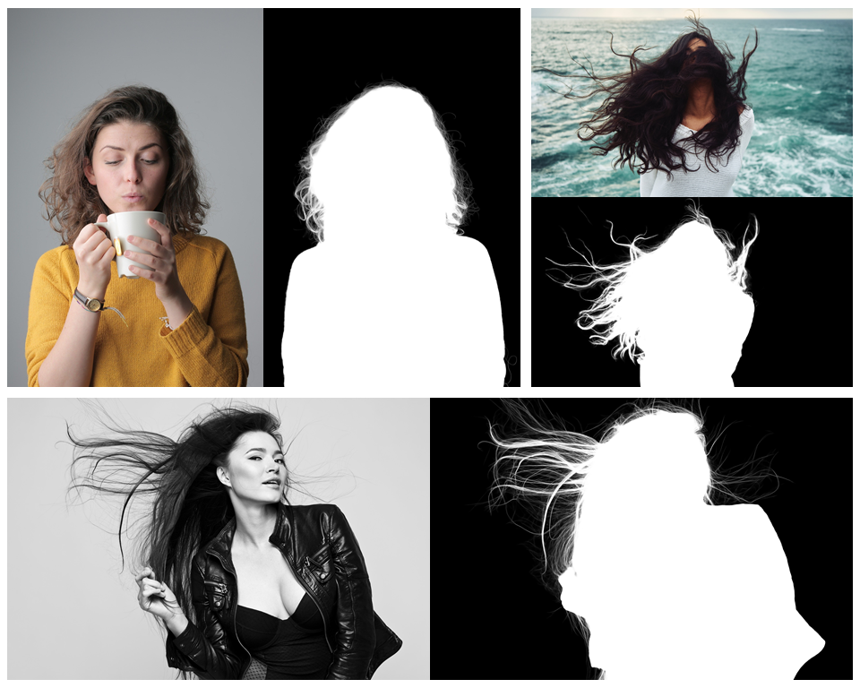
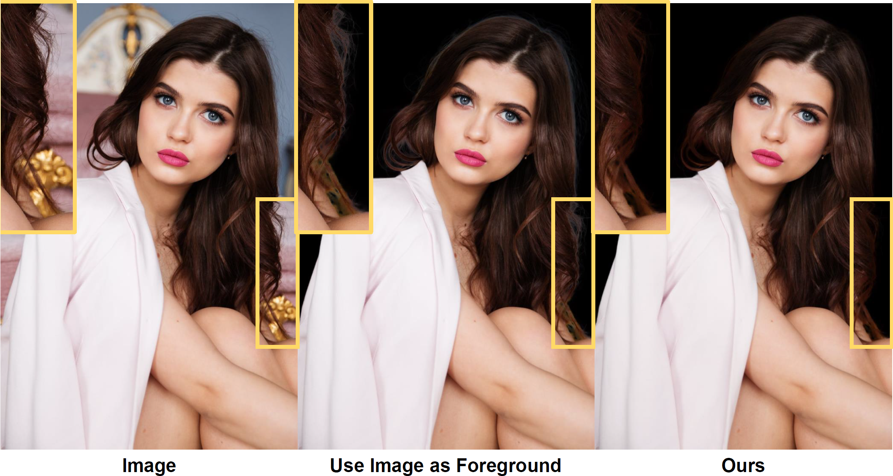

# Mask Guided Matting via Progressive Refinement Network

<p align="center">
  
</p>

This repository includes the official project of Mask Guided (MG) Matting, presented in our paper:

**[Mask Guided Matting via Progressive Refinement Network](https://arxiv.org/abs/2012.06722)**

[Johns Hopkins University](https://ccvl.jhu.edu/), [Adobe Research](https://research.adobe.com/)


<p align="center">
  
</p>
<p align="center">
  
</p>


**Check out more visual results and comparisons of MG Matting to other fully automatic matting systems and matting models. Please note that image matting results contains methods (except LFM) trained on public Composition-1k only, while in fully automatic matting system methods are trained with different internal datasets.**

- [Google Drive - Fully Automatic Matting System](https://drive.google.com/file/d/1fTEWWDcxxENAcux8wiESDmtG3AxsZevP/view?usp=sharing)
- [Google Drive - Image Matting Results](https://drive.google.com/file/d/1kvkMQArxK_4HcxVxp7NPlNUdNE6I9sLa/view?usp=sharing) 

<br>**or preview them at**

- [Fully Automatic Matting System](result/SYSTEM.md)
- [Image Matting Results](result/IMAGE.md)

## Highlights
- **Trimap-free Alpha Estimation:** MG Matting does not require a carefully annotated trimap as guidance inputs. Instead, it takes a general rough mask, which could be generated by segmentation or saliency models automatically, and predicts an alpha matte with great details;



- **Foreground Color Prediction:** MG Matting predicts the foreground color besides alpha matte, we notice and address the inaccuracy of foreground annotations in Composition-1k by Random Alpha Blending;



- **No Additional Training Data:** MG Matting is trained only with the widely-used publicly avaliable synthetic dataset Composition-1k, and shows great performance on both synthetic and real-world benchmarks.

## News
- 15 Dec 2020: Visually comparisons of different fully automatic matting systems are avaliable in [SYSTEM.md](result/SYSTEM.md).

- 15 Dec 2020: Release [Arxiv version of paper](https://arxiv.org/abs/2012.06722) and [visualizations of sample images and videos](result/RESULT.md).

## TODO
- Inference demo, real-world portrait benchmark shall be released soon. Before that, if you want to test your model on the real-world portrait benchmark or compare results with MG Matting, feel free to contact Qihang Yu (yucornetto@gmail.com).


## Visualization Examples
We provide examples for visually comparing MG Matting with other matting methods. We also note that our model can even potentially deal with video matting. 

In addition, we also use an internal portrait dataset consisting of 4395 images to train an even stronger MG Matting model, and construct a fully automatic matting system based on it. We provide visually comparison of this automatic matting system with other latest matting methods including [MODNet](https://github.com/ZHKKKe/MODNet) and commercial softwares such as Adobe PhotoShop.

***Please refer to [RESULT.md](result/RESULT.md) for more visualization results.***

## Dataset
In our experiments, **only Composition-1k training set is used to train the model**. And the obtained model is evaluated on three dataset: Composition-1k, Distinction-646, and our real-world portrait dataset.

**For Compsition-1k**, please contact Brian Price (bprice@adobe.com) requesting for the dataset. And please refer to [GCA Matting](https://github.com/Yaoyi-Li/GCA-Matting) for dataset preparation.

**For Distinction-646**, please refer to [HAttMatting](https://github.com/wukaoliu/CVPR2020-HAttMatting) for the dataset.

**Our real-world portrait dataset** shall be released to public soon.

## Citation
If you find this work or code useful for your research, please use the following BibTex entry:
```
@article{yu2020mask,
  author  = {Yu, Qihang and Zhang, Jianming and Zhang, He and Wang, Yilin and Lin, Zhe and Xu, Ning and Bai, Yutong and Yuille, Alan},
  title   = {Mask Guided Matting via Progressive Refinement Network},
  journal = {arXiv preprint arXiv:2012.06722},
  year    = {2020}
}
```

## Lisence
Research only
