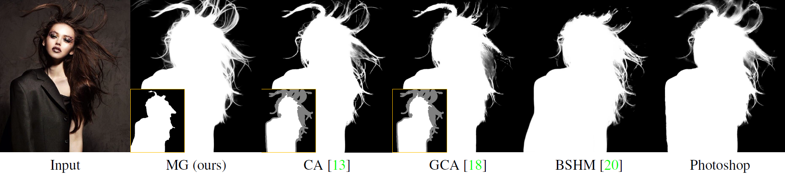

# Mask Guided Matting via Progressive Refinement Network

<p align="center">
  
</p>

This repository includes the official project of Mask Guided (MG) Matting, presented in our paper:

**[Mask Guided Matting via Progressive Refinement Network](https://arxiv.org/abs/2012.06722)** (CVPR 2021)

[Johns Hopkins University](https://ccvl.jhu.edu/), [Adobe Research](https://research.adobe.com/)

## News
- 22 Apr 2021: Update the code base and pre-trained weights.

- 22 Mar 2021: Our real-world portrait dataset is now publicly avaliable at [here](https://livejohnshopkins-my.sharepoint.com/:u:/g/personal/qyu13_jh_edu/EXVd6ga9f9xBjkDv6nPMDtcB_rYaJhnkkS6XGvmzc_6Rfw). Codes (both training and inference) are released, please refer to [code-base](code-base).  

- 15 Dec 2020: Visually comparisons of different fully automatic matting systems are avaliable in [SYSTEM.md](result/SYSTEM.md).

- 15 Dec 2020: Release [Arxiv version of paper](https://arxiv.org/abs/2012.06722) and [visualizations of sample images and videos](result/RESULT.md).

## Highlights
- **Trimap-free Alpha Estimation:** MG Matting does not require a carefully annotated trimap as guidance inputs. Instead, it takes a general rough mask, which could be generated by segmentation or saliency models automatically, and predicts an alpha matte with great details;


- **Foreground Color Prediction:** MG Matting predicts the foreground color besides alpha matte, we notice and address the inaccuracy of foreground annotations in Composition-1k by Random Alpha Blending;


- **No Additional Training Data:** MG Matting is trained only with the widely-used publicly avaliable synthetic dataset Composition-1k, and shows great performance on both synthetic and real-world benchmarks.

## Visualization Examples
We provide [examples](result/RESULT.md) for visually comparing MG Matting with other matting methods. We also note that our model can even potentially deal with video matting. 

## Dataset
In our experiments, **only Composition-1k training set is used to train the model**. And the obtained model is evaluated on three dataset: Composition-1k, Distinction-646, and our real-world portrait dataset.

**For Compsition-1k**, please contact Brian Price (bprice@adobe.com) requesting for the dataset. And please refer to [GCA Matting](https://github.com/Yaoyi-Li/GCA-Matting) for dataset preparation.

**For Distinction-646**, please refer to [HAttMatting](https://github.com/wukaoliu/CVPR2020-HAttMatting) for the dataset.

**Our real-world portrait dataset**, it is available to public and you can download it at [this link](https://livejohnshopkins-my.sharepoint.com/:u:/g/personal/qyu13_jh_edu/EXVd6ga9f9xBjkDv6nPMDtcB_rYaJhnkkS6XGvmzc_6Rfw).

## Citation
If you find this work or code useful for your research, please use the following BibTex entry:
```
@article{yu2020mask,
  title={Mask Guided Matting via Progressive Refinement Network},
  author={Yu, Qihang and Zhang, Jianming and Zhang, He and Wang, Yilin and Lin, Zhe and Xu, Ning and Bai, Yutong and Yuille, Alan},
  journal={arXiv preprint arXiv:2012.06722},
  year={2020}
}
```
## Acknowledgment
[GCA-Matting](https://github.com/Yaoyi-Li/GCA-Matting)

[FBA Matting](https://github.com/MarcoForte/FBA_Matting)

## Lisence
Research only;

The project can only be redistributed under a Creative Commons Attribution-NonCommercial 2.0 Generic (CC BY-NC 2.0) license; the terms of which are available at https://creativecommons.org/licenses/by-nc/2.0/deed.en_GB.
