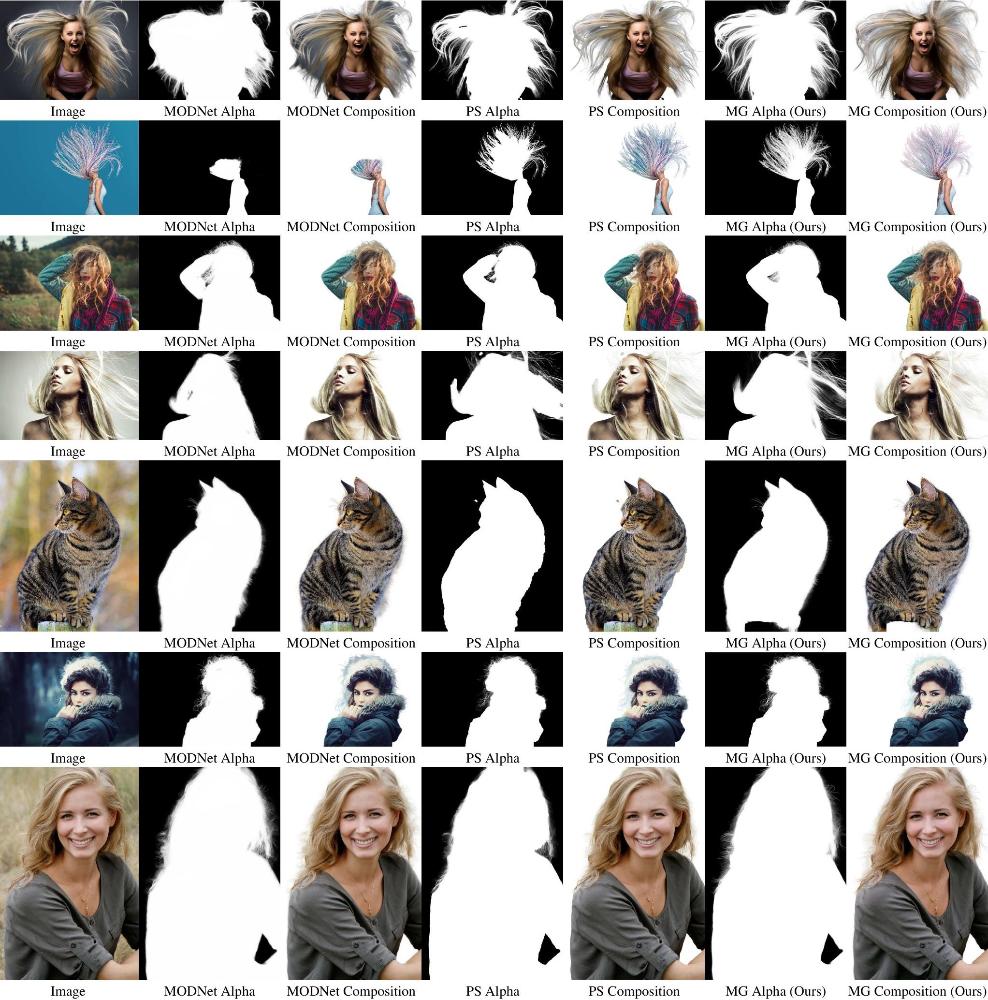
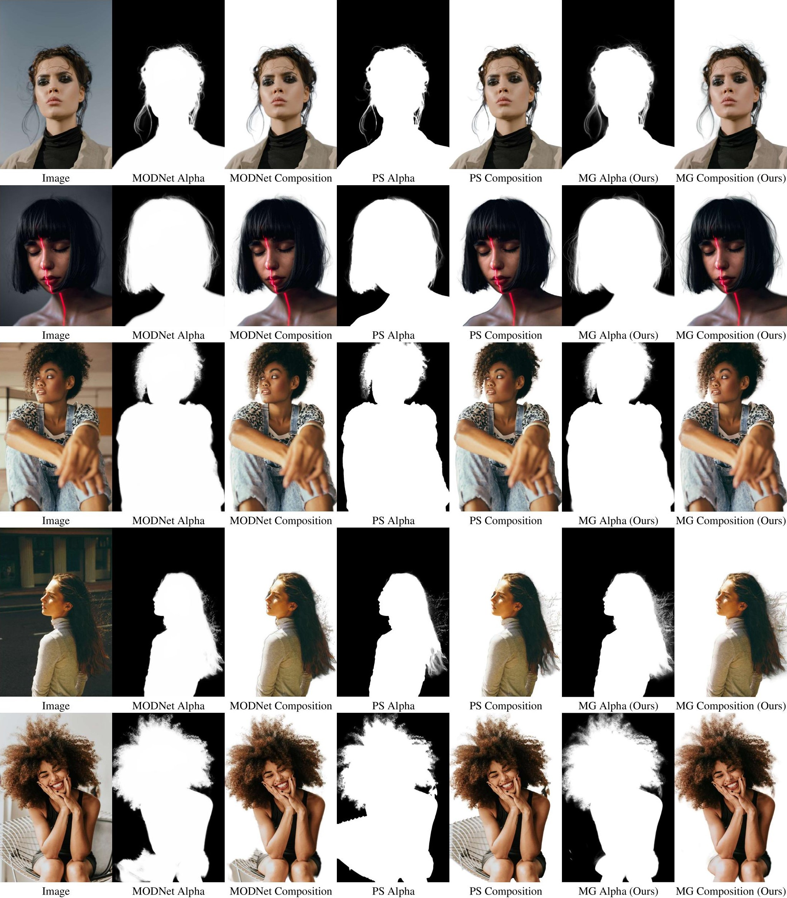
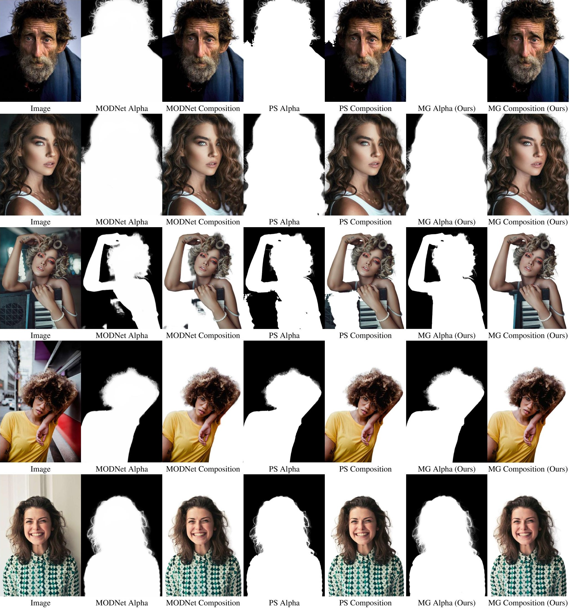
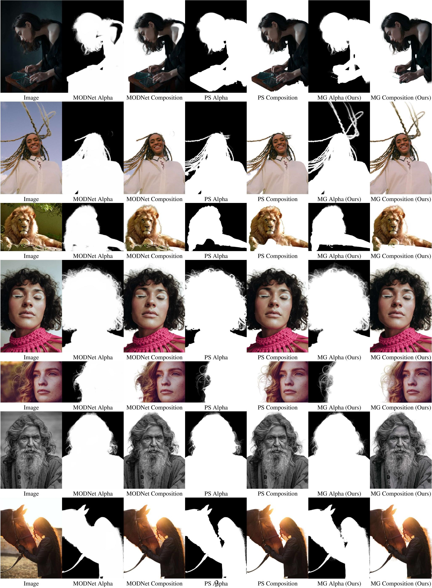
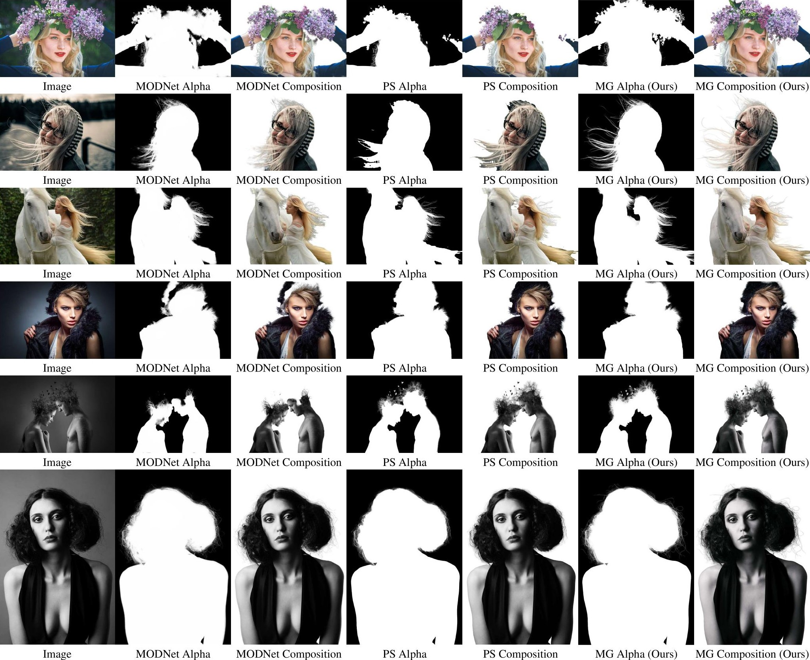

## Fully Automatic Matting System
We further train MG Matting with an internal portrait matting dataset consisting of 4395 samples, and combine it with a base segmentation model to obtain a fully automatic matting system. We compare this system to latest trimap-free matting system [MODNet](https://github.com/ZHKKKe/MODNet) and also commercial software Photoshop 2021.

You can also access high-resolution figures in PDF format at [Google Drive](https://drive.google.com/file/d/1fTEWWDcxxENAcux8wiESDmtG3AxsZevP/view?usp=sharing) or this [Github file](system-merged.pdf).

  

  

  

  

  

