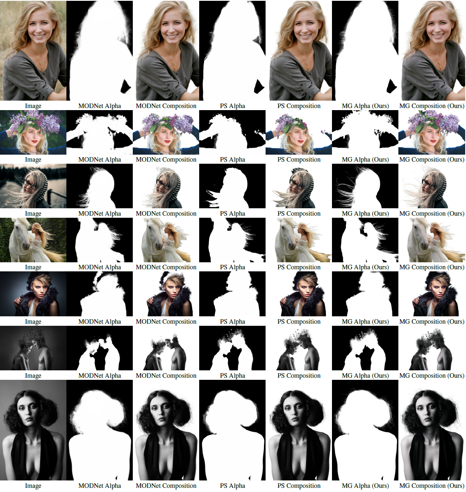
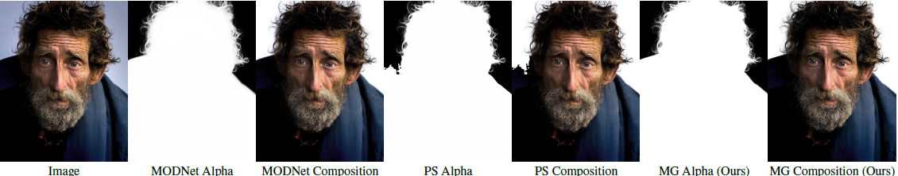
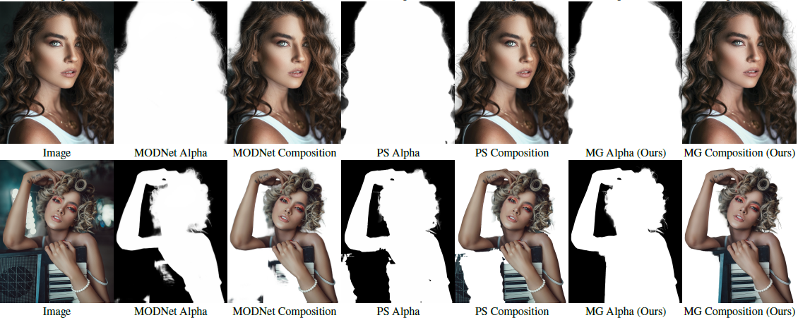
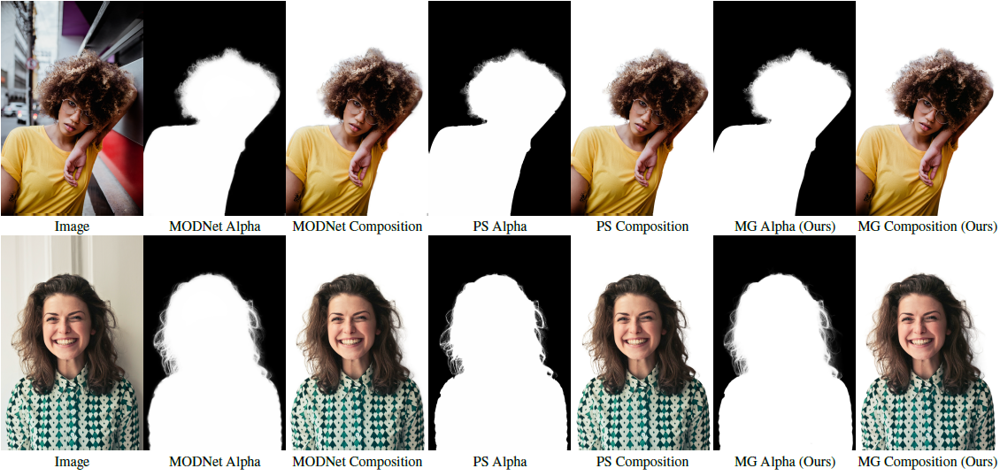
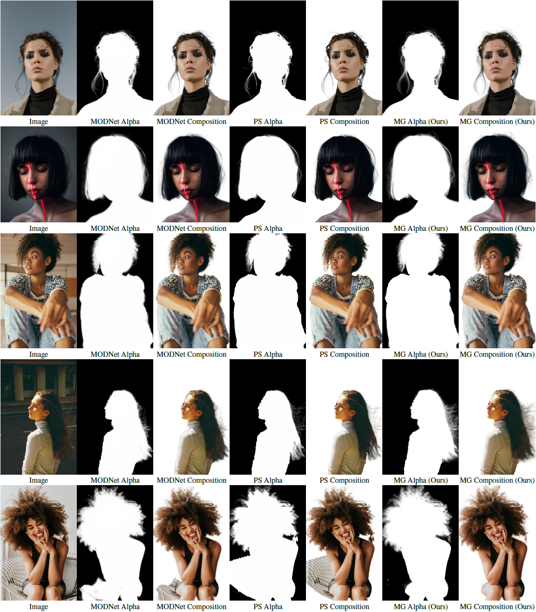
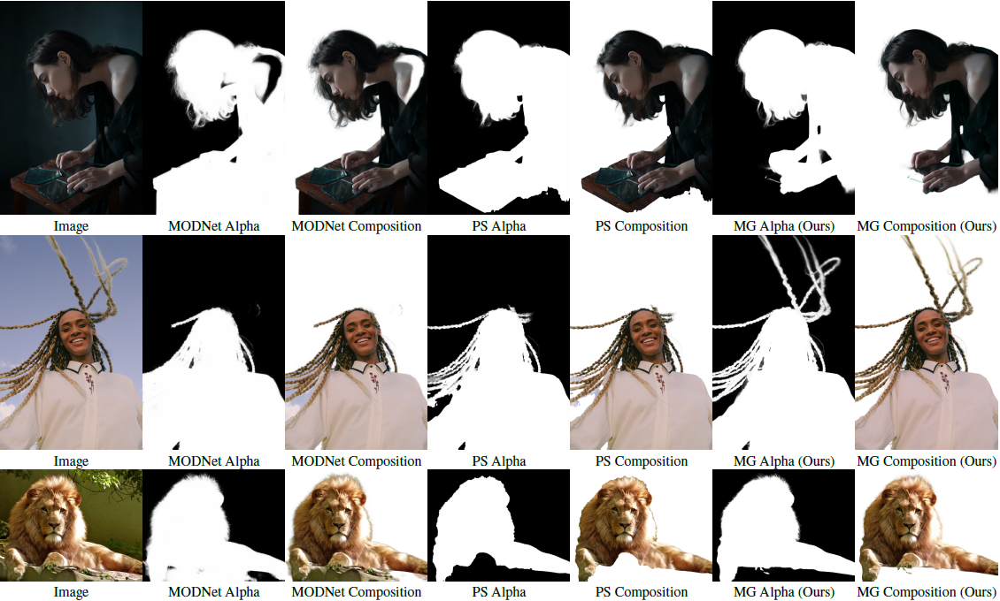
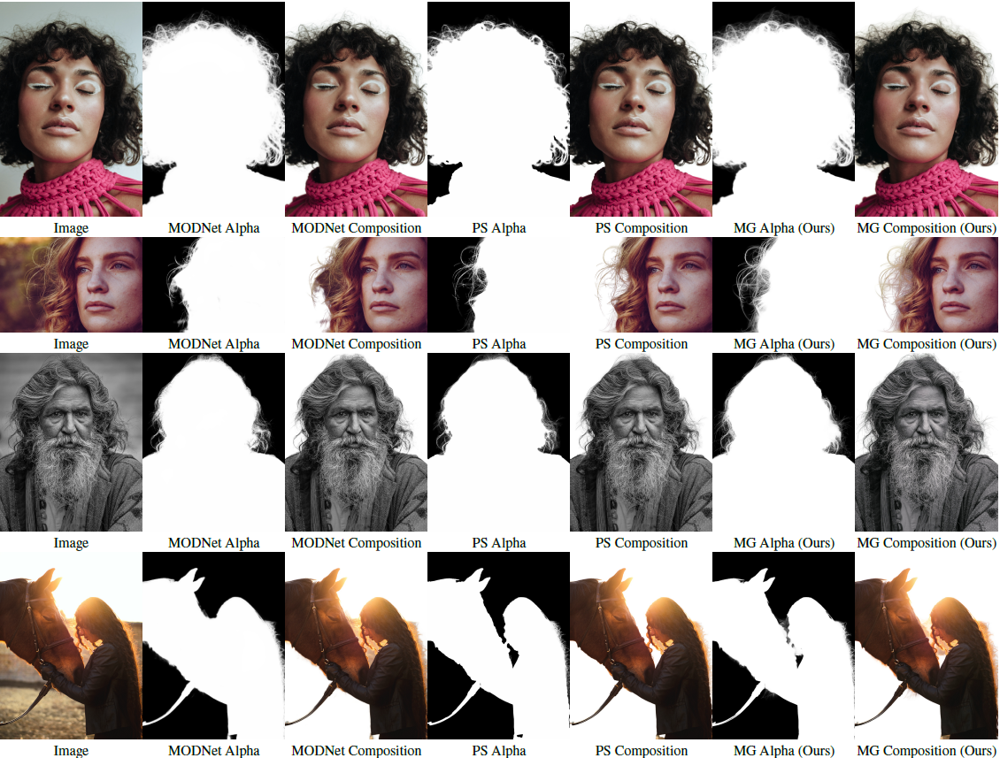

## Fully Automatic Matting System
We further train MG Matting with an internal portrait matting dataset consisting of 4395 samples, and combine it with a base segmentation model to obtain a fully automatic matting system. We compare this system to latest trimap-free matting system [MODNet](https://github.com/ZHKKKe/MODNet) and also commercial software Photoshop 2021.

  

  

  

  

  

  

  

  

